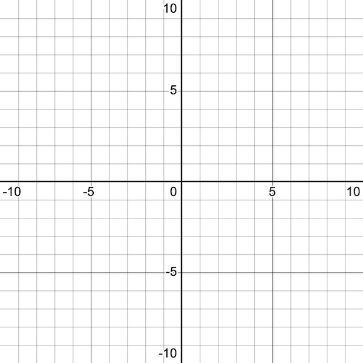
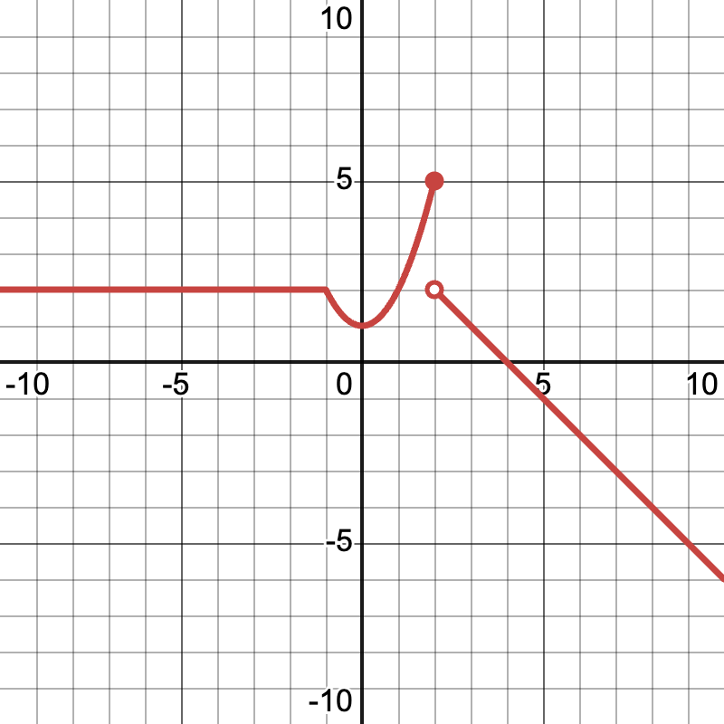

<!-- command: render -->
# Homework: Piecewise Functions and Limits

Name: __________________________

Date: __________________________

---

## Part 1: Domain and Range Review

1. In your own words, explain what the **domain** of a function means.  
   \vspace{2cm}

2. In your own words, explain what the **range** of a function means.  
   \vspace{2cm}

3. Give an example of a function with:
   - Domain: all real numbers
   - Range: $[0, \infty)$  
   Write the formula and explain why the domain and range match your description.  
   \vspace{3cm}

---

\vspace{5cm}

## Part 2: Graph the Given Piecewise Functions

For each function:

1. Graph it on the provided coordinate grid.
2. Clearly label any open or closed circles.
3. State the **domain** and **range**.

### Function 1 — Linear pieces
$$
f_1(x) =
\begin{cases}
2x + 1, & x < 1 \\
x - 2, & x \ge 1
\end{cases}
$$

**Domain:** ___________________  
**Range:** ___________________

---

\vspace{3cm}

### Function 2 — Quadratic and linear
$$
f_2(x) =
\begin{cases}
x^2 - 4, & x \le 0 \\
- x + 1, & x > 0
\end{cases}
$$

**Domain:** ___________________  
**Range:** ___________________

---

\vspace{3cm}

### Function 3 — Sine and cosine
$$
f_3(x) =
\begin{cases}
\sin(x), & x < \pi \\
\cos(x), & x \ge \pi
\end{cases}
$$

**Domain:** ___________________  
**Range:** ___________________

---

\vspace{3cm}

## Part 3: Limits at Specific Points

For each function above, answer the following questions **for the given $x$-values**.  
Show your work and write answers in exact form when possible.

---

### Function 1 — $f_1(x)$
Evaluate at $x = 1, \; -2, \; 0, \; 3$.

| $a$  | $\lim_{x \to a^-} f_1(x)$ | $\lim_{x \to a^+} f_1(x)$ | $\lim_{x \to a} f_1(x)$ exists? | $f_1(a)$ |
|------|--------------------------|--------------------------|--------------------------------|----------|
| 1    |                          |                          |                                |          |
| -2   |                          |                          |                                |          |
| 0    |                          |                          |                                |          |
| 3    |                          |                          |                                |          |

---

### Function 2 — $f_2(x)$
Evaluate at $x = 0, \; -1, \; 1, \; 2$.

| $a$  | $\lim_{x \to a^-} f_2(x)$ | $\lim_{x \to a^+} f_2(x)$ | $\lim_{x \to a} f_2(x)$ exists? | $f_2(a)$ |
|------|--------------------------|--------------------------|--------------------------------|----------|
| 0    |                          |                          |                                |          |
| -1   |                          |                          |                                |          |
| 1    |                          |                          |                                |          |
| 2    |                          |                          |                                |          |

---

### Function 3 — $f_3(x)$
Evaluate at $x = \pi, \; 0, \; \frac{\pi}{2}, \; 4$.

| $a$             | $\lim_{x \to a^-} f_3(x)$ | $\lim_{x \to a^+} f_3(x)$ | $\lim_{x \to a} f_3(x)$ exists? | $f_3(a)$ |
|-----------------|--------------------------|--------------------------|--------------------------------|----------|
| $\pi$           |                          |                          |                                |          |
| $0$             |                          |                          |                                |          |
| $\frac{\pi}{2}$ |                          |                          |                                |          |
| $4$             |                          |                          |                                |          |

---

## Part 4: Write the Equation from a Graph

Below is the graph of a piecewise function.  
Write its equation using proper piecewise notation.

$$
g(x) =
\begin{cases}
 &  \\
 & 
\end{cases}
$$

---

## Part 5: Algebra Review — Solving Equations

Solve each equation for $x$. Show all steps and check for extraneous solutions where appropriate.

1. $x^2 - 7x + 12 = 0$
2. $3x^2 - 2x - 8 = 0$
3. $x^3 - 4x^2 - 5x + 20 = 0$  *(Hint: factor by grouping)*
4. $\frac{2}{x} + 3 = \frac{5}{x}$
5. $\frac{x+1}{x-2} = 3$
6. $\frac{1}{x+2} + \frac{2}{x-1} = \frac{7}{x^2 + x - 2}$

---

## Part 6: Think!

1. What is the difference between the graphs of function $f(x)=x+2$ and the graph of $g(x)=\frac{x^2-4}{x-2}$
